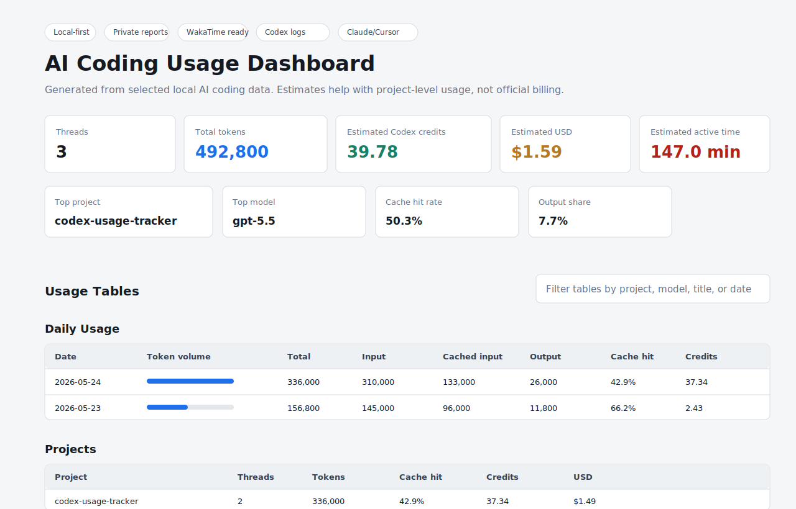

# Codex Usage Tracker

Local-first usage analytics for the Codex app.

Codex Usage Tracker reads your local Codex app logs and generates a private dashboard for token usage, estimated Codex credits, API-equivalent cost estimates, project breakdowns, and optional WakaTime `ai coding` time.



## Why

AI coding tools can burn through a lot of tokens, but it is hard to answer basic questions:

- Which project used the most tokens?
- Which thread was the most expensive?
- How much active Codex time did I spend today?
- How much of my input was cached?
- Can my Codex app activity show up in WakaTime?

This tool gives you those answers locally, without uploading Codex transcripts to another service.

## Features

- Reads local Codex app rollout logs from `~/.codex`
- Generates `HTML`, `CSV`, and `JSON` reports
- Breaks usage down by day, project, model, and thread
- Estimates Codex credits from token usage
- Shows API-equivalent USD estimates for rough comparison
- Sends optional WakaTime `ai coding` heartbeats
- Works without an OpenAI API key
- Keeps generated reports out of git by default

## Install

Clone the repo:

```bash
git clone https://github.com/SuvenSeo/codex-usage-tracker.git
cd codex-usage-tracker
```

Run directly with Python:

```bash
python codex_app_tracker.py report
```

Or install the CLI locally:

```bash
pip install -e .
codex-usage-tracker report
```

## Usage

Generate reports:

```bash
python codex_app_tracker.py report
```

Generate reports for the last 7 days:

```bash
python codex_app_tracker.py --days 7 report
```

Generate reports and sync recent Codex activity to WakaTime:

```bash
python codex_app_tracker.py run --sync-wakatime
```

Open the dashboard:

```text
out/dashboard.html
```

## WakaTime

WakaTime sync is optional. It requires `wakatime-cli` and a normal `~/.wakatime.cfg` file.

The tracker sends conservative heartbeats with:

- category: `ai coding`
- entity type: `app`
- project name/folder
- timestamp

It does not send prompts, responses, transcripts, or token totals to WakaTime.

On Windows, you can install a scheduled task:

```powershell
.\install_scheduled_task.ps1
```

Remove it:

```powershell
.\uninstall_scheduled_task.ps1
```

## Output

By default, reports are written to `out/`:

- `dashboard.html`
- `codex_usage_summary.json`
- `threads.csv`
- `daily.csv`
- `projects.csv`
- `models.csv`

Do not commit generated reports. They can include private local paths, project names, thread titles, and usage details.

## Cost Estimates

The tracker reports exact local token counts where Codex logs provide them.

Cost estimates are not an invoice:

- `estimated_codex_credits` uses OpenAI's Codex token-based rate card.
- `estimated_api_usd_equiv` uses public OpenAI API prices as an equivalent estimate.
- Real Codex billing/credit balance should be checked in Codex Settings > Usage or OpenAI billing.

Pricing can change. Review and update `MODEL_RATES` in `codex_app_tracker.py` when OpenAI updates rates.

## Privacy

This is a local parser. It reads from `~/.codex` and writes local reports.

See [docs/PRIVACY.md](docs/PRIVACY.md) before sharing dashboards or CSV files.

## Development

Run checks:

```bash
python -m py_compile codex_app_tracker.py
python -m unittest discover -s tests -v
```

## Status

Early alpha. Codex local log formats may change, so parser compatibility can break. Issues and PRs are welcome.
