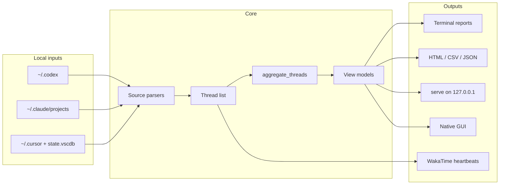

# Architecture

AI Coding Usage Tracker is a local-first Python application. It reads AI coding
tool logs on disk, normalizes them into a shared **thread** model, aggregates
usage, and renders reports through the CLI, static files, a live web dashboard,
or a native Tkinter GUI.

There is no server backend, database product, or cloud sync. Everything runs on
the user's machine.

## High-Level Flow

## Modules

| Module | Role |
| --- | --- |
| `codex_app_tracker.py` | CLI entry point, parsers, aggregation, HTML/CSV/JSON writers, `serve`, WakaTime sync, billing/source-audit helpers, and `CodexUsageTrackerGui` |
| `report_cache.py` | Disk cache under `~/.codex-usage-tracker/report_cache/` for GUI startup and incremental refresh |
| `gui_visuals.py` | Brand logos, donut/mix-bar charts, accent strip, and Tk canvas helpers |
| `codex_usage_tracker_gui.py` | Thin Windows EXE launcher that defaults to `--sources all gui` |

Packaging exposes two console scripts from `codex_app_tracker:main`:

- `ai-coding-usage-tracker` (preferred)
- `codex-usage-tracker` (legacy alias)

## Data Model

Every parsed session becomes a **thread** dictionary with a common shape:

- Identity: `thread_id`, `app`, `source`, `project`, `model`
- Timing: `started_at`, `ended_at`, optional `event_timestamps`
- Usage: `input_tokens`, `cached_input_tokens`, `output_tokens`, `total_tokens`, plus provider-specific cache fields
- Metadata: `title`, `path`, `cwd`, and other parser-specific fields

`aggregate_threads()` rolls threads into a **summary** with:

- Global usage totals and cache ratios
- Per-day, per-project, per-model, and per-source breakdowns
- Codex credit estimates and USD equivalents where rates exist
- Optional budget alerts and billing connector status

Terminal commands, `report`, `serve`, and the GUI all consume the same thread
list and summary. Privacy flags (`--redact`, `--hash-projects`) are applied when
building shareable view models, not when reading raw logs.

## Source Parsers

Source selection is opt-in via `--sources`. Default is `codex` only.

| Source | Local paths | Notes |
| --- | --- | --- |
| **Codex** | `~/.codex/sessions/**/*.jsonl`, optional `state_5.sqlite` | Deepest support: exact token counts, Codex credit estimates, WakaTime sync |
| **Claude Code** | `~/.claude/projects/**/*.jsonl` | Token totals from transcript usage blocks; Anthropic USD estimates when model rates are known |
| **Cursor** | `~/.cursor/projects` (Agent transcripts), `%APPDATA%/Cursor/.../state.vscdb` (Composer bubbles + `agentKv`), `~/.cursor/ai-tracking/ai-code-tracking.db` | Token totals are **estimated** when Cursor stores zero counts; context-cache replay mirrors Claude-style cache-read accounting |

`load_selected_threads()` loads all enabled sources and merges threads.
`load_report_data(use_cache=True)` reuses unchanged files from the report cache
by comparing file size and `mtime` fingerprints.

## Output Surfaces

### Static reports (`report`, `demo`, `run`)

Writes to `--output-dir` (default `out/`):

- `dashboard.html` — self-contained dark-theme dashboard with searchable tables
- `codex_usage_summary.json`
- `threads.csv`, `daily.csv`, `projects.csv`, `models.csv`, `sources.csv`

`source-audit` additionally writes `source_audit.json` and `source_audit.md`.

### Live web dashboard (`serve`)

Starts a dependency-free HTTP server on `127.0.0.1`. The page auto-refreshes
and reuses the same HTML generator as static reports. Provider tabs, budget
signals, and connector status are embedded in the summary model.

### Native GUI (`gui`)

`CodexUsageTrackerGui` runs in a background thread:

1. On launch, `load_cached_gui_model()` restores the last dashboard instantly.
2. `load_report_data(use_cache=True)` incrementally refreshes changed logs.
3. `build_gui_view_model()` formats provider cards, charts, and capped tables.
4. `save_report_cache()` persists threads, fingerprints, and the GUI model.

Large GUI tables are capped (`threads` 400, `projects` 150, `daily` 90) for
responsiveness. Full data remains available via **HTML report**.

Brand logos load from `assets/gui/brands/` (bundled in the Windows EXE).

### WakaTime (`sync-wakatime`, `run --sync-wakatime`)

Sends conservative `ai coding` heartbeats through `wakatime-cli` for **Codex**
activity only. Prompts, responses, and token totals are not sent.

## Configuration and State

| Path | Purpose |
| --- | --- |
| `~/.codex-usage-tracker/state.json` | Default WakaTime dedupe state |
| `~/.codex-usage-tracker/report_cache/*.json` | GUI incremental cache keyed by source/path args |
| `--output-dir` | Generated reports |
| `--state-file` | Override WakaTime state location |

Optional billing connector env vars (`OPENAI_ADMIN_KEY`, `ANTHROPIC_ADMIN_KEY`,
`CURSOR_ADMIN_API_KEY`) are checked for presence only unless `billing --fetch`
is used explicitly.

## Pricing

Model rates live in `MODEL_RATES` inside `codex_app_tracker.py`. Reports include
pricing metadata and source dates. Estimates are labeled as non-invoice
equivalents; official spend requires vendor billing tools.

## Packaging

- **PyPI**: `setuptools` ships `codex_app_tracker`, `gui_visuals`, and
  `report_cache` as top-level modules.
- **Windows EXE**: PyInstaller one-file build via `scripts/build_windows_exe.ps1`
  bundles brand assets and hidden-imports GUI modules.
- **CI**: compile all three modules and run `tests/test_tracker.py`.

## Extension Points

Likely future seams (not all implemented yet):

- Parser interface for additional agents (OpenCode, Gemini CLI, etc.)
- External `pricing.json` with a refresh command
- Richer WakaTime AI metadata fields
- Statusline output for shell prompts

See [ROADMAP.md](ROADMAP.md) for planned work.
